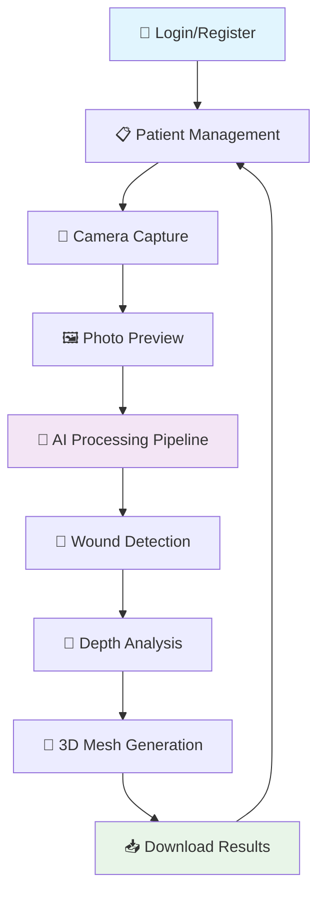
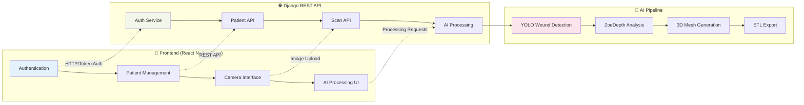
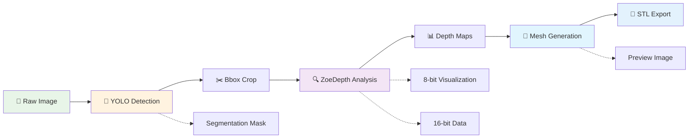

# HydroFast Wound Analysis Application

## AI-Powered Mobile Wound Assessment with 3D Reconstruction & ZoeDepth Integration

A comprehensive **wound analysis mobile application** built with **React Native (Expo)** and **Django REST Framework** that leverages **artificial intelligence for medical wound assessment**. Features **YOLO-based wound detection**, **ZoeDepth monocular depth estimation**, **3D mesh generation**, and **STL file export** for medical professionals and healthcare providers.

**Keywords:** wound analysis, medical AI, mobile healthcare, depth estimation, 3D reconstruction, YOLO segmentation, ZoeDepth, React Native, Django, wound assessment, medical imaging, healthcare technology

---

## 📊 Application Flow & Architecture

### User Journey Flow


### System Architecture


### AI Processing Pipeline


---

## 🚀 Quick Start (For Users)

### Prerequisites
- **Mobile Device** with Expo Go app installed
- **Computer** with Python 3.8+ and Node.js 16+
- **Same Wi-Fi network** for both devices

### 1. Environment Setup
```bash
# Clone the repository
git clone <repository-url>
cd Project-2

# Backend environment
cp .env.example .env
# Edit .env and add your Gemini API key: GEMINI_API_KEY=your_key_here

# Frontend environment  
cp frontend/.env.example frontend/.env
# IP will be auto-configured when starting backend
```

### 2. Backend Setup
```bash
# Create virtual environment
python -m venv .venv
# Windows: .venv\Scripts\activate
# Mac/Linux: source .venv/bin/activate

# Install dependencies
pip install -r requirements.txt

# Setup database and sample data
cd backend
python manage.py migrate
python manage.py create_default_user
python manage.py load_sample_patients

# Start server (shows IP address for mobile)
python scripts/run_server.py
```

### 3. Frontend Setup
```bash
# In new terminal
cd frontend
npm install
npm start
# Scan QR code with Expo Go app on mobile device
```

### 4. Default Login
- **Username:** `admin` **Password:** `admin`
- **Username:** `default_user` **Password:** `default_password`

---

## 🛠️ Development Setup (For Contributors)

### Development Environment
```bash
# Enhanced development setup
cd backend
pip install -r requirements/development.txt  # Includes testing & debug tools

# Enable debug mode
export DJANGO_SETTINGS_MODULE=config.settings.development

# Run with detailed logging
python manage.py runserver --verbosity=2

# Frontend development with hot reload
cd frontend
npm install
npx expo start --clear  # Clear cache for development
```

### Development Tools
- **Backend:** Django Debug Toolbar, pytest, black formatter
- **Frontend:** Expo Dev Tools, React Developer Tools
- **AI Models:** Located in `weights/` directory
- **Database:** SQLite for development, PostgreSQL for production

### Project Structure
- **Detailed structure:** See [Project directory.md](Project%20directory.md)
- **Technical documentation:** See [context.md](context.md)
- **Architecture:** Django modular apps + React Native feature-based organization

---

## 🤝 Contributing Guidelines

### Code Standards
- **Python:** Follow PEP 8, use `black` formatter
- **JavaScript:** ES6+, functional components with hooks
- **Commits:** Use conventional commit format
- **Testing:** Write tests for new features

### Pull Request Process
1. **Fork** the repository and create a feature branch
2. **Write tests** for new functionality  
3. **Run tests:** `python manage.py test` (backend), `npm test` (frontend)
4. **Format code:** `black .` (Python), `npm run format` (JS)
5. **Update documentation** if needed
6. **Submit PR** with clear description and linked issues

### Development Workflow
```bash
# Before starting work
git checkout main
git pull origin main
git checkout -b feature/your-feature-name

# Before submitting PR
python manage.py test          # Run backend tests
npm test                       # Run frontend tests (if available)
black backend/                 # Format Python code
npm run format                 # Format JavaScript code
```

### Issue Reporting
- **Use issue templates** when available
- **Check existing issues** before creating new ones
- **Include:** OS, Python/Node versions, error logs
- **For bugs:** Steps to reproduce, expected vs actual behavior

---

## ⚠️ Known Issues & Limitations

### Current Limitations
- **STL Preview:** Large mesh files may load slowly in mobile interface
- **Network Dependency:** Requires stable Wi-Fi for AI processing
- **Storage:** Processed files accumulate in media directory (use `backend/clean_media.py`)
- **Authentication:** Password reset functionality not yet implemented

### Planned Improvements
- **Performance:** STL preview optimization for mobile devices
- **Features:** Real-time scan history integration  
- **AI Models:** Additional wound classification models
- **Export:** PDF report generation with measurements
- **Offline:** Basic functionality without internet connection

### Workarounds
- **Large STL files:** Use download feature instead of preview
- **Storage cleanup:** Run `python backend/clean_media.py --force` periodically
- **Network issues:** Ensure both devices on same Wi-Fi, check IP configuration

---

## 💖 Support & Community

### Get Help
- **Documentation:** [context.md](context.md) for technical details
- **Issues:** GitHub Issues for bug reports and feature requests
- **Discussions:** GitHub Discussions for questions and community support

### Support This Project
If this project has been helpful for your medical research or clinical practice, consider:

- ⭐ **Star this repository** to help others discover it
- 🐛 **Report bugs** and suggest improvements
- 🤝 **Contribute code** or documentation
- 💬 **Share feedback** about your use case

### Tech Stack
- **Backend:** Django 5.1.3, Django REST Framework, ZoeDepth, YOLO, OpenCV
- **Frontend:** React Native 0.76.9, Expo SDK 52, React Navigation 6
- **AI/ML:** PyTorch, Ultralytics YOLO, ZoeDepth Monocular Depth Estimation
- **Database:** SQLite (dev), PostgreSQL (prod)

---

**🔬 Built for medical professionals, researchers, and healthcare technology enthusiasts**

*This application is designed for educational and research purposes. Always consult healthcare professionals for medical decisions.*