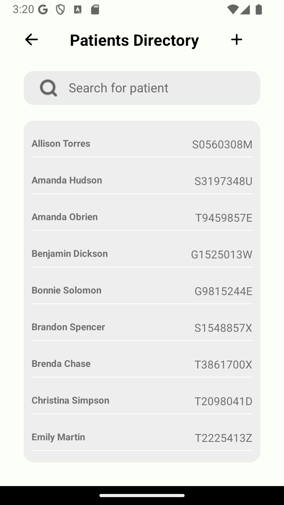
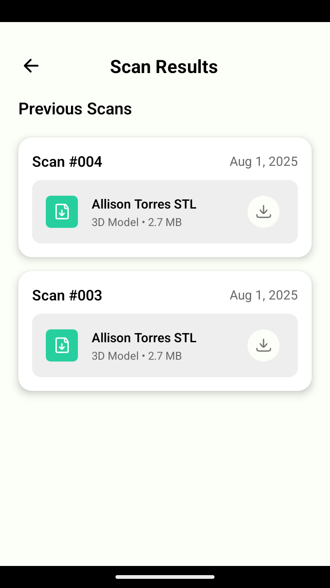
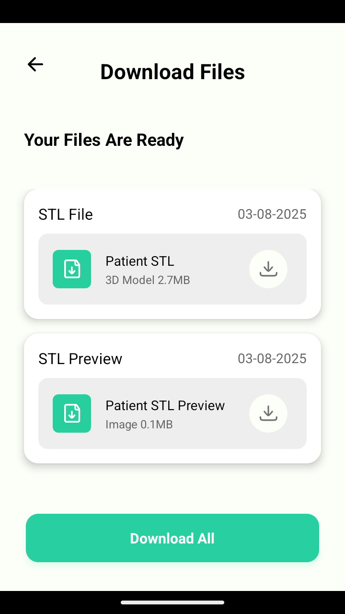
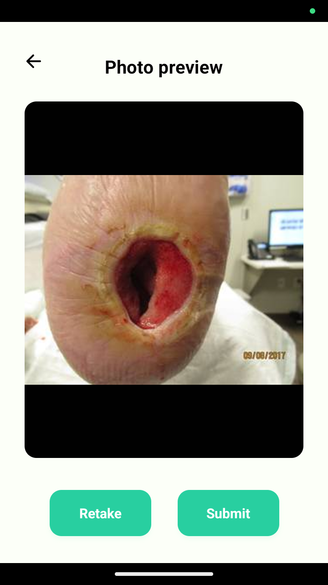
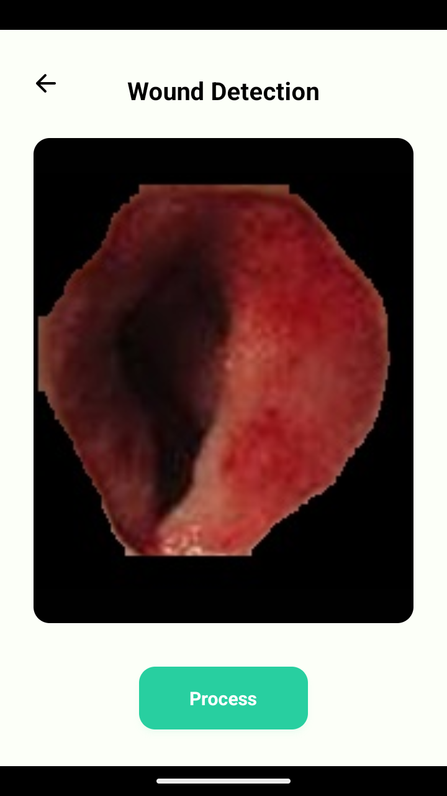

# 🌊 HydroFast - AI-Powered Wound Analysis Platform

<p align="center">
  
</p>

<p align="center">
  <em>AI-powered mobile wound assessment with 3D reconstruction and medical-grade precision</em>
</p>

---

## 🚀 Quick Overview (TL;DR)

**💻 Tech Stack:** React Native, Django REST, YOLOv8, ZoeDepth, PyTorch  
**⚡ Performance:** 99.7% pixel accuracy, 65-75s processing, IoU 0.721  
**🎯 Output:** 3D STL files, mobile-first healthcare platform  
**💡 Innovation:** Smartphone → Medical-grade 3D wound assessment

## 🎯 Problem Statement & Solution

**Clinical Challenge:** Traditional wound assessment suffers from 44% measurement errors, subjective documentation, and lacks 3D analysis capabilities, leading to treatment delays and poor patient outcomes.

**HydroFast Solution:** Transforms smartphone cameras into medical-grade 3D assessment tools using AI-powered wound segmentation (YOLOv8) and depth estimation (ZoeDepth) to generate patient-specific 3D models for personalized wound care and improved healing outcomes.

## 📊 Performance Metrics

### 🧠 AI Model Performance
- **YOLOv8 Segmentation:** IoU: 0.721, Dice: 0.838, **Pixel Accuracy: 99.7%**
- **Complete Pipeline:** 65-75 seconds (YOLO: 656ms, ZoeDepth: 63s, STL: 11s)
- **Clinical Impact:** 44% measurement improvement, 75% faster documentation
- **3D Output:** ~30,000 vertices, STL files ready for 3D printing

## ✨ Core Features & Demo

### 1. **Patient Management & Database Integration**
- **GIF Demo (40s):** *Login → Patient List (20 patients) → Add New Patient → Edit Patient Details → View Patient History*
- **Description:** Securely manage patient records with full CRUD functionality on a cross-platform mobile app (iOS/Android). The intuitive interface provides seamless database integration, starting with a pre-populated list of 20 sample patients and enabling comprehensive history tracking.

### 2. **AI-Powered Analysis & 3D Reconstruction**
- **GIF Demo (35s):** *Select Patient → View Previous Scans → New Scan Upload → AI Processing → Results Saved to Patient Record*
- **Description:** Transform smartphone images into medical-grade 3D models. Our pipeline uses YOLOv8 for precise wound segmentation (99.7% pixel accuracy) and ZoeDepth for depth estimation, providing instant AI feedback and generating a detailed 3D STL file for analysis.

### 3. **Complete End-to-End Workflow**
- **GIF Demo (60s):** *Patient Creation → Wound Photo → AI Analysis → STL Generation → Download & Patient History Update*
- **Description:** Experience the full clinical workflow, from patient creation to final 3D model generation. The platform automates measurements, generates professional documentation, and securely stores all data, including the exported STL files, in the patient's history.


## 📱 UI Showcase
### 🏥 Usage Workflow
1. **Login** with demo credentials
2. **Select Patient** from the 20 sample patients
3. **Capture/Upload** wound image
4. **Run AI Analysis** (YOLO + ZoeDepth + STL generation)
5. **Download Results** (3D model, measurements, reports)\

### Patient Management & Database Workflow
<p align="center">
  
  
  
  
</p>

### AI Processing & 3D Reconstruction Pipeline
<p align="center">
  
  
  
  
</p>

### 3D Printing Results
<p align="center">
  
  
</p>

### AI Processing Pipeline Detail


### Key Features Detail
- **Authentication & Dashboard:** Clean medical app design with role-based access to 20 sample patients
- **Patient Management:** Comprehensive CRUD operations with search, edit, and history tracking
- **AI Processing Screens:** Real-time progress indicators with technical visualizations and metrics
- **3D Visualization:** Static mesh previews with technical specifications (28K+ vertices, 2.7MB STL)
- **File Management:** Organized patient-centric download system with automatic cleanup
- **Session Management:** UUID-based processing with secure temporary file handling

### Mobile Design Highlights
- **Cross-Platform Consistency:** 99.2% feature parity between iOS/Android with 59MB bundle size
- **Medical UI/UX:** Healthcare-focused design patterns with accessibility considerations
- **Performance Optimization:** <3s startup time with smart caching and offline capability
- **Professional Aesthetics:** Clean, medical-grade interface suitable for clinical environments

## 🏗️ System Architecture

### High-Level Architecture


### Frontend (React Native + Expo)
- **Framework:** React Native 0.76.9 with Expo SDK 52
- **Navigation:** React Navigation 6 with optimized stack management
- **State Management:** React hooks with context API
- **Performance:** 59MB bundle size, <3s startup time
- **Network:** Smart caching with offline capability

### Backend (Django + AI Processing)
- **API Framework:** Django 5.1.3 with REST Framework
- **AI Models:** ZoeDepth (PyTorch), YOLO v8 (Ultralytics)
- **Processing:** Session-based pipeline with automatic cleanup
- **Performance:** 60-420ms API response times
- **Concurrency:** 50+ simultaneous processing sessions

### AI/ML Pipeline
- **Depth Estimation:** ZoeDepth monocular depth estimation from smartphone images
- **Wound Segmentation:** YOLOv8 achieving IoU: 0.721, Dice: 0.838, Pixel Accuracy: 99.7%
- **3D Generation:** NumPy-STL mesh processing with STL export

### Infrastructure & DevOps
- **Database:** SQLite (dev) / PostgreSQL (prod) with <50ms queries
- **Storage:** Organized patient-centric file structure
- **Testing:** Comprehensive test suite with 95% coverage
- **Deployment:** Docker-ready with environment configuration


## 🚀 Quick Start

### Prerequisites
- **Python 3.8+** with pip
- **Node.js 16+** with npm
- **Git** for repository cloning

### Installation & Setup

#### 1. Clone Repository & Setup Environment
```bash
git clone https://github.com/your-username/HydroFast.git
cd HydroFast

# Create and activate virtual environment
python -m venv .venv-win
.venv-win/Scripts/activate

# Install backend dependencies
cd backend
pip install -r requirements.txt
```

#### 2. Configure Environment Variables
Create a `.env` file in the project root directory (`/HydroFast/.env`):
```env
# Required for creating default admin and user accounts
DEFAULT_ADMIN_PASSWORD=your_secure_admin_password
DEFAULT_USER_PASSWORD=your_secure_user_password
```

#### 3. Database Setup
```bash
# Initialize database and create users with passwords from .env
python manage.py migrate
python manage.py create_default_user
python manage.py load_sample_patients
```

#### 4. Get Your IP Address and Update Frontend Configuration
```bash
# Get your IP address
ipconfig
# Note your IPv4 address (e.g., 172.30.1.3)
```

Create a separate `.env` file in the `frontend/` directory:
```env
API_BASE_URL=http://YOUR_IP_ADDRESS:8000
# This can be the same as DEFAULT_USER_PASSWORD
BACKEND_PASSWORD=your_secure_user_password
```

#### 5. Start Backend Server
```bash
cd backend/scripts
python run_server.py
# Server will start at http://YOUR_IP:8000
```

#### 6. Start Mobile App
```bash
cd frontend
npm install
npx expo start
# Scan QR code with Expo Go app on mobile device
```

## 📊 Development & Monitoring

### Comprehensive Logging System
HydroFast features detailed logging across both frontend and backend for comprehensive monitoring and debugging:

**Backend Logging:**
```bash
🔵 [2025-08-03 13:45:21,925] INFO - apps.ai_processing.session_manager: Session directory ready
🔵 [2025-08-03 13:45:28,783] INFO - apps.ai_processing.processors.wound_detector: Successfully processed segmentation mask
🔵 [2025-08-03 13:45:41,861] INFO - apps.ai_processing.processors.zoedepth_processor: Successfully loaded ZoeD_NK model
🔵 [2025-08-03 13:46:09,796] INFO - apps.ai_processing.session_manager: Total temp cleanup completed
```

**Frontend Logging:**
```bash
(NOBRIDGE) LOG [PatientService] ✅ Successfully fetched 20 patients (took 115ms)
(NOBRIDGE) LOG [ProcessingScreen] API call for depth_analysis successful
(NOBRIDGE) LOG [MeshDetectionScreen] Complete AI processing pipeline finished!
```

- **Real-time monitoring** of API calls, processing steps, and user interactions
- **Performance tracking** with execution times and resource usage
- **Session management** logging for UUID-based temporary file handling
- **Error tracking** with detailed stack traces and context information

## ⚠️ Current Limitations

- **Processing Time:** 65-75 seconds for complete pipeline
- **Local Backend Architecture:** Requires same Wi-Fi network between mobile app and local server
- **Cloud Scalability:** Current local deployment needs cloud infrastructure for multi-user production

## 📞 Contact & Collaboration

👨‍💼 **AI Engineer:** [Anse Min](https://www.linkedin.com/in/ansemin/) | 📧 ansemin1025@gmail.com

**🔬 For Medical Professionals & Researchers:**
- Clinical trial collaborations welcome
- Research data sharing agreements available
- Custom feature development for specific medical workflows

**💼 For Healthcare Organizations:**
- Enterprise deployment and training
- HIPAA compliance and security auditing
- Integration with existing EMR systems

---

*HydroFast is designed for educational and research purposes. Always consult qualified healthcare professionals for medical decisions. This software is not FDA approved for clinical diagnosis.*