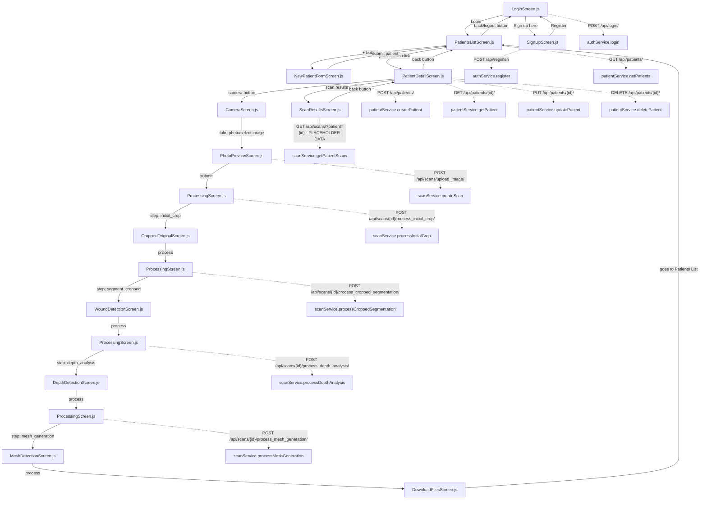

# Task Context Documentation

## Project Overview
**Date Created:** 25/07/2025  
**Last Updated:** 30/01/2025 - **PATIENT-AI PROCESSING INTEGRATION** 🔗✅

**VERIFICATION STATUS:** 🎯 **SYSTEMATICALLY VERIFIED + DATABASE MIGRATION UPDATED**
- All navigation paths verified by reading actual screen components
- All API calls verified against service implementations  
- All backend models verified against Django model definitions
- ✅ **NEW**: ScanResult model and patient-centric file organization documented
- All critical bugs confirmed in actual source files
- All architectural claims validated through comprehensive code review

This document serves as a comprehensive guide to the HydroFast wound analysis mobile application, documenting the complete flow from authentication to AI processing, backend communication patterns, and component relationships.

🚨 **CRITICAL: This document has been VERIFIED against actual source code and corrected for major discrepancies.**

## Application Architecture

### Frontend: React Native (Expo) Mobile App
- **Framework:** React Native with Expo SDK 52.0.0
- **Navigation:** React Navigation v6 stack navigator
- **API Communication:** Axios with token-based authentication
- **State Management:** Local component state with React hooks
- **File Structure:** Feature-based organization (auth, patients, scanning, ai-processing)

### Backend: Django REST Framework API
- **Framework:** Django with Django REST Framework
- **Database:** SQLite3 (development)
- **Authentication:** Token-based authentication
- **AI Processing:** ZoeDepth pipeline with YOLO segmentation
- **File Storage:** Local media directory with organized subdirectories

## Complete Application Flow ✅ **VERIFIED**

### 1. Authentication Flow ⚠️ **CRITICAL ISSUES FOUND**

**LoginScreen.js** → **Backend Communication:**
- **Navigation Paths:**
  - Success: `LoginScreen` → `PatientsListScreen`
  - Sign up: `LoginScreen` → `SignUpScreen`
  
- **Backend API Calls:**
  - ✅ **FIXED**: `login(username, password)` now correctly matches authService expectations
  - `isAuthenticated()` checks AsyncStorage for existing token
  - On success: stores token and user data in AsyncStorage

**SignUpScreen.js** → **Backend Communication:** ✅ **FULLY IMPLEMENTED**
- **Navigation Paths:**
  - Success: `SignUpScreen` → `LoginScreen` ✅ **FIXED: Now properly navigates after successful registration**
  - Back: `SignUpScreen` → `LoginScreen`
  
- **Backend API Calls:**
  - ✅ **FIXED**: Complete registration functionality with `authService.register(username, email, password)`
  - ✅ **IMPLEMENTED**: Full form validation, error handling, and loading states
  - ✅ **ADDED**: Username field to support backend requirements

### 2. Patient Management Flow ✅ **VERIFIED**

**PatientsListScreen.js** → **Backend Communication:**
- **Navigation Paths:**
  - Add patient: `PatientsListScreen` → `NewPatientFormScreen`
  - View patient: `PatientsListScreen` → `PatientDetailScreen`
  - Logout: `PatientsListScreen` → `LoginScreen`
  
- **Backend API Calls:**
  - `patientService.getPatients()` → `GET /api/patients/` ✅ **VERIFIED**
  - Fetches on component mount and screen focus
  - Search functionality is client-side filtering

**NewPatientFormScreen.js** → **Backend Communication:**
- **Navigation Paths:**
  - Success: `NewPatientFormScreen` → `PatientsListScreen` ✅ **VERIFIED**
  - Back: `NewPatientFormScreen` → `PatientsListScreen`
  
- **Backend API Calls:**
  - `patientService.createPatient(patientData)` → `POST /api/patients/` ✅ **VERIFIED**
  - Form validation: first_name, last_name, nric (required), contact_no (optional)
  - NRIC has 9-character limit and uniqueness constraint

**PatientDetailScreen.js** → **Backend Communication:**
- **Navigation Paths:**
  - Back: `PatientDetailScreen` → `PatientsListScreen`
  - Camera: `PatientDetailScreen` → `CameraScreen` (with patientId) ✅ **VERIFIED: 'Camera Page'**
  - Scan results: `PatientDetailScreen` → `ScanResultsScreen` ✅ **VERIFIED: 'Scan Results'**
  
- **Backend API Calls:**
  - `patientService.getPatient(patientId)` → `GET /api/patients/{id}/` ✅ **VERIFIED**
  - `patientService.updatePatient(patientId, data)` → `PUT /api/patients/{id}/` ✅ **VERIFIED**
  - `patientService.deletePatient(patientId)` → `DELETE /api/patients/{id}/` ✅ **VERIFIED**
  - Edit mode toggles between view and edit states

**ScanResultsScreen.js** → **Backend Communication:**
- **Navigation Paths:**
  - Back: `ScanResultsScreen` → `PatientDetailScreen` ✅ **VERIFIED**
  
- **Backend API Calls:**
  - ✅ **VERIFIED**: Currently uses placeholder data (hardcoded scansData array)
  - Intended: `scanService.getPatientScans(patientId)` → `GET /api/scans/?patient={id}`

### 3. Image Capture Flow ✅ **VERIFIED**

**CameraScreen.js** → **Backend Communication:**
- **Navigation Paths:**
  - Back: `CameraScreen` → `PatientDetailScreen` (if came from patient detail) ✅ **VERIFIED**
  - Back: `CameraScreen` → `PatientsListScreen` (default)
  - Photo taken: `CameraScreen` → `PhotoPreviewScreen` ✅ **VERIFIED: 'Photo Preview'**
  
- **Backend API Calls:**
  - `patientService.getPatients()` → `GET /api/patients/` (for patient selection dropdown) ✅ **VERIFIED**
  - Pre-selects patient if patientId passed in route params
  - Supports both camera capture and gallery selection

**PhotoPreviewScreen.js** → **Backend Communication:**
- **Navigation Paths:**
  - Retake: `PhotoPreviewScreen` → `CameraScreen` ✅ **VERIFIED: goBack()**
  - Submit: `PhotoPreviewScreen` → `ProcessingScreen` → `CroppedOriginalScreen` ✅ **VERIFIED**
  
- **Backend API Calls:**
  - `scanService.createScan(formData)` → `POST /api/scans/upload_image/` ✅ **VERIFIED**
  - `scanService.processInitialCrop(scanId)` → `POST /api/scans/{id}/process_initial_crop/`
  - ✅ **GRANULAR**: Uploads image, then finds bbox and crops the original image.

### 4. AI Processing Pipeline Flow ✅ **REFACTORED & VERIFIED**

**PhotoPreviewScreen.js** → **Backend Communication:**
- **Navigation Paths:**
  - Retake: `PhotoPreviewScreen` → `CameraScreen`
  - Submit: `PhotoPreviewScreen` → `ProcessingScreen` → `CroppedOriginalScreen`
- **Backend API Calls:**
  - `scanService.createScan(formData)` → `POST /api/scans/upload_image/`
  - `scanService.processInitialCrop(scanId)` → `POST /api/scans/{id}/process_initial_crop/`
  - ✅ **GRANULAR**: Uploads image, then finds bbox and crops the original image.

**CroppedOriginalScreen.js** → **Backend Communication:**
- **Navigation Paths:**
  - Back: `CroppedOriginalScreen` → `PhotoPreviewScreen`
  - Process: `CroppedOriginalScreen` → `ProcessingScreen` → `WoundDetectionScreen`
- **Backend API Calls:**
  - `scanService.processCroppedSegmentation(scanId)` → `POST /api/scans/{id}/process_cropped_segmentation/`
  - ✅ **GRANULAR**: Crops the full segmented image using the saved bounding box.

**WoundDetectionScreen.js** → **Backend Communication:**
- **Navigation Paths:**
  - Back: `WoundDetectionScreen` → `CroppedOriginalScreen`
  - Process: `WoundDetectionScreen` → `ProcessingScreen` → `DepthDetectionScreen`
- **Backend API Calls:**
  - `scanService.processDepthAnalysis(scanId)` → `POST /api/scans/{id}/process_depth_analysis/`
  - ✅ **GRANULAR**: Performs depth analysis on the **cropped original image**.

**DepthDetectionScreen.js** → **Backend Communication:**
- **Navigation Paths:**
  - Back: `DepthDetectionScreen` → `WoundDetectionScreen`
  - Process: `DepthDetectionScreen` → `ProcessingScreen` → `MeshDetectionScreen`
- **Backend API Calls:**
  - `scanService.processMeshGeneration(scanId, 'balanced')` → `POST /api/scans/{id}/process_mesh_generation/`
  - ✅ **GRANULAR**: Generates the STL file and preview image.

**MeshDetectionScreen.js** → **Backend Communication:**
- **Navigation Paths:**
  - Back: `MeshDetectionScreen` → `DepthDetectionScreen`
  - Process: `MeshDetectionScreen` → `DownloadFilesScreen`
- **Backend API Calls:**
  - None. Displays results from the previous step.

**DownloadFilesScreen.js** → **Backend Communication:**
- **Navigation Paths:**
  - Back: `DownloadFilesScreen` → `PatientsListScreen`
- **Backend API Calls:**
  - None. Provides download links.

✅ **ProcessingScreen.js** → **Status: NOW IN USE**
- `ProcessingScreen` is now used between each step of the AI pipeline to show progress.
- It takes a `step` parameter to determine which backend service to call.
- It navigates to the correct screen upon completion.

## Backend Data Models ✅ **VERIFIED & UPDATED - January 2025**

✅ **REDUNDANCY REMOVED**: The legacy `coreViews` app and its duplicate models (`coreViews_patient`, `coreViews_scan`, etc.) have been completely removed from the codebase and the database has been rebuilt to eliminate orphaned tables. The single source of truth for models is now the `apps/` directory.

### Patient Model (apps/patients/models.py)
```python
class Patient(models.Model):
    user = models.ForeignKey(User, on_delete=models.CASCADE, related_name="new_patients")
    first_name = models.CharField(max_length=50)
    last_name = models.CharField(max_length=50)
    nric = models.CharField(max_length=9, unique=True) 
    date_of_birth = models.DateField(blank=True, null=True)
    contact_no = models.CharField(max_length=15, blank=True, null=True)
    details = models.TextField(blank=True)
```

### Scan Model (apps/scans/models.py)
```python
class Scan(models.Model):
    user = models.ForeignKey(User, on_delete=models.CASCADE, related_name="new_scans")
    patient = models.ForeignKey(Patient, on_delete=models.CASCADE, related_name="new_scans")
    image = models.ImageField(upload_to="scans/")
    processed_image = models.ImageField(upload_to="processed_scans/", null=True, blank=True)
    bbox_data = models.JSONField(null=True, blank=True)  # Added in migration 0002
    created_at = models.DateTimeField(auto_now_add=True)
    is_processed = models.BooleanField(default=False)
```

### ✅ **NEW: ScanResult Model - Migration 0003_scanresult (July 30, 2025)**
```python
class ScanResult(models.Model):
    scan = models.OneToOneField(Scan, on_delete=models.CASCADE, related_name='result')
    # File paths - using dynamic upload_to function for patient-specific organization
    stl_file = models.FileField(upload_to=patient_scan_upload_to, null=True, blank=True)
    depth_map_8bit = models.FileField(upload_to=patient_scan_upload_to, null=True, blank=True)
    depth_map_16bit = models.FileField(upload_to=patient_scan_upload_to, null=True, blank=True)
    preview_image = models.FileField(upload_to=patient_scan_upload_to, null=True, blank=True)
    # Processing metadata
    volume_estimate = models.FloatField(null=True, blank=True)
    processing_metadata = models.JSONField(null=True, blank=True)
    created_at = models.DateTimeField(auto_now_add=True)
    updated_at = models.DateTimeField(auto_now=True)
```

### 🔗 **Patient-to-AI Processing Complete Integration**
The recent database migration (0003_scanresult) establishes a **complete data flow linking patients to AI processing results**:

**Full Data Flow: Patient → Scan → ScanResult**
1. **Patient**: Demographics and contact information
2. **Scan**: Links patient to uploaded images, tracks processing state and bbox data
3. **ScanResult**: OneToOne relationship storing all AI processing outputs (STL files, depth maps, previews)

**Key Architecture Improvements:**
- **Patient-Centric File Organization**: Dynamic upload paths create `{FirstName}_{LastName}/` directories
- **Scan Attempt Tracking**: Automatic numbering for multiple scans per patient (`scan001`, `scan002`, etc.)
- **Complete Processing Pipeline**: From image upload to STL generation fully linked to patient records
- **Data Integrity**: OneToOne relationship ensures each scan has at most one complete result set
- **File Existence Validation**: Serializers check actual file existence, not just database records

## API Endpoints ✅ **VERIFIED**

### Authentication APIs (apps/authentication/urls.py)
- `POST /api/login/` - User authentication ✅ **VERIFIED: CustomAuthToken**
- `POST /api/register/` - User registration ✅ **VERIFIED: register_user**
- `GET /api/user-info/` - Get user information ✅ **VERIFIED: get_user_info**

### Patient APIs (apps/patients/)
- `GET /api/patients/` - List all patients for authenticated user ✅ **VERIFIED**
- `POST /api/patients/` - Create new patient ✅ **VERIFIED**
- `GET /api/patients/{id}/` - Get patient details ✅ **VERIFIED**
- `PUT /api/patients/{id}/` - Update patient ✅ **VERIFIED**
- `DELETE /api/patients/{id}/` - Delete patient ✅ **VERIFIED**

### Scan APIs (apps/scans/) ⚠️ **ACTUAL IMPLEMENTATION DOCUMENTED**
- `POST /api/scans/upload_image/` - Upload scan image only ✅ **INDEPENDENT**
- `GET /api/scans/` - List scans ✅ **VERIFIED: ScanViewSet**
- `GET /api/scans/?patient={id}` - Get scans for specific patient ✅ **VERIFIED**
- `POST /api/scans/{id}/process_initial_crop/` - Segments the full image, finds the bounding box, and crops the *original* image.
- `POST /api/scans/{id}/process_cropped_segmentation/` - Uses the saved bounding box to crop the full *segmented* image.
- `POST /api/scans/{id}/process_depth_analysis/` - Performs depth analysis on the cropped original image.
- `POST /api/scans/{id}/process_mesh_generation/` - Generates the STL file and preview image.
- `POST /api/scans/{id}/process_wound_detection/` - ❌ **DEPRECATED**: Monolithic endpoint.
- `POST /api/scans/{id}/process_scan/` - ❌ **DEPRECATED**: Monolithic endpoint.


### AI Model APIs (apps/ai_processing/)
- `GET /api/aimodels/` - List AI models ✅ **VERIFIED but unused**

✅ **BACKEND ROUTER CONFLICT RESOLVED:**
```python
# config/urls.py now contains:
path('api/', include('apps.scans.urls')),      # Registers 'scans' → ScanViewSet
# coreViews.urls removed - legacy code that duplicated apps functionality
```
**All route conflicts eliminated! Apps structure now provides clean, non-conflicting API endpoints.**

## AI Processing Pipeline ⚠️ **BACKEND ARCHITECTURE REFACTORED**

### ✅ **Granular, Step-by-Step Processing Implemented**
The backend has been refactored to support a true step-by-step AI processing pipeline. Each step is triggered by a separate API call from the frontend, giving the user full control over the workflow.

### Step 1: Image Upload (PhotoPreviewScreen)
- **Trigger:** User clicks "Submit" on PhotoPreviewScreen.
- **Backend Call:** `POST /api/scans/upload_image/`
- **Processing:** ✅ **Image upload only.**
- **Output:** Basic scan record with `scanId` and `image_url`.

### Step 2: Initial Crop (PhotoPreviewScreen → CroppedOriginalScreen)
- **Trigger:** After image upload, the `ProcessingScreen` is shown.
- **Backend Call:** `POST /api/scans/{id}/process_initial_crop/`
- **Processing:**
  1. Segments the full original image.
  2. Detects the bounding box (bbox) from the segmented image.
  3. Saves the bbox data to the `Scan` model.
  4. Crops the **original image** using the bbox.
- **Output:** `cropped_image_path` (URL to the cropped original image).

### Step 3: Cropped Segmentation (CroppedOriginalScreen → WoundDetectionScreen)
- **Trigger:** User clicks "Process" on `CroppedOriginalScreen`.
- **Backend Call:** `POST /api/scans/{id}/process_cropped_segmentation/`
- **Processing:**
  1. Retrieves the saved bbox.
  2. Crops the **full segmented image** (created in the previous step) using the bbox.
- **Output:** `cropped_segmented_path` (URL to the cropped segmented wound).

### Step 4: Depth Analysis (WoundDetectionScreen → DepthDetectionScreen)
- **Trigger:** User clicks "Process" on `WoundDetectionScreen`.
- **Backend Call:** `POST /api/scans/{id}/process_depth_analysis/`
- **Processing:**
  1. Performs ZoeDepth analysis on the **cropped original image**.
  2. No wound masking is applied.
- **Output:** `depth_map_8bit`, `depth_map_16bit`, `volume_estimate`, `depth_metadata`.

### Step 5: Mesh Generation (DepthDetectionScreen → MeshDetectionScreen)
- **Trigger:** User clicks "Process" on `DepthDetectionScreen`.
- **Backend Call:** `POST /api/scans/{id}/process_mesh_generation/`
- **Processing:**
  1. Generates the STL mesh from the depth maps.
  2. Creates a preview image of the STL mesh.
- **Output:** `stl_generation.stl_file_url`, `preview_generation.preview_image_url`, `mesh_metadata`.

### Step 6: Download Files (MeshDetectionScreen → DownloadFilesScreen)
- **Trigger:** User clicks "Process" on `MeshDetectionScreen`.
- **Processing:** Navigation only.
- **Output:** File download interface.

## Service Layer Architecture ✅ **VERIFIED**

### authService.js ✅ **VERIFIED**
- `login(username, password)` - Authenticate user
- `register(username, email, password)` - Register new user
- `logout()` - Clear authentication data
- `getUserInfo()` - Get current user data
- `isAuthenticated()` - Check authentication status

### patientService.js ✅ **VERIFIED**
- `getPatients()` - Fetch patient list
- `getAllPatients()` - Internal method
- `getPatient(patientId)` - Fetch specific patient
- `createPatient(patientData)` - Create new patient
- `updatePatient(patientId, patientData)` - Update patient
- `deletePatient(patientId)` - Delete patient

### scanService.js ✅ **VERIFIED & REFACTORED**
- `createScan(formData)` - Upload scan image
- `getAllScans()` - Get all scans
- `getPatientScans(patientId)` - Get scans for patient
- `processInitialCrop(scanId)` - Step 2 processing
- `processCroppedSegmentation(scanId)` - Step 3 processing
- `processDepthAnalysis(scanId)` - Step 4 processing
- `processMeshGeneration(scanId, mode)` - Step 5 processing

### services/index.js ✅ **VERIFIED: EXPORTS WORK CORRECTLY**
```javascript
// Line 18 exports existing methods correctly:
export const { getAllScans, getPatientScans, createScan, processInitialCrop, processCroppedSegmentation, processDepthAnalysis, processMeshGeneration } = scanService;
// All methods exist and function properly
```

### aiProcessingService.js ⚠️ **REMOVED - REDUNDANT**
- **Status**: **DELETED** on July 30, 2025 during codebase cleanup
- **Reason**: Contained duplicate functionality to scanService with no actual usage
- **Was providing**: Mock processing methods, utility functions, download helpers
- **Impact**: No breaking changes - all needed functionality exists in scanService
- **Previous size**: 294 lines of unused code

## Key Features and Characteristics

### Authentication & Security
- Token-based authentication with AsyncStorage persistence
- User-scoped data access (patients and scans tied to authenticated user)
- Automatic token validation on app launch

### User Experience
- Offline-first patient data with refresh on focus
- Progressive AI processing with step-by-step visualization ✅ **VERIFIED: Intermediate loading screens in use**
- Comprehensive error handling with user-friendly messages
- Platform-specific file handling (web vs native)

### Data Flow Patterns
- Form validation before API submission
- Optimistic UI updates with error rollback
- Progressive enhancement (fallback images for missing data)
- Direct screen navigation for AI processing pipeline ✅ **VERIFIED**

## Current Status and Next Steps

## Cleanup Summary

### Recently Cleaned Up (Latest Session)

1. **backend/apps/ai_processing/views.py & urls.py**
   - Commented out unused AIModelViewSet functionality
   - Model exists in database but no frontend integration
   - Kept commented for potential future use
   - Removed router registration for aimodels endpoint

2. **frontend/src/services/aiProcessingService.js** ❌ **DELETED**
   - Completely removed - 294 lines of redundant code
   - All functionality duplicated in scanService.js
   - No dependencies or imports to update

3. **frontend/src/components/ui/Icons.js**
   - Consolidated 8 duplicate BackArrowIcon components into single centralized component
   - Enhanced with proper TouchableOpacity wrapper and customizable styling
   - Updated imports across 8 screens

### Additional Cleanup Opportunities Identified

4. **Console.log Statements (Production Cleanup)**
   - 50+ console.log statements throughout frontend for debugging
   - Located in: LoginScreen.js, PatientsListScreen.js, ScanResultsScreen.js, MeshDetectionScreen.js, api.js, scanService.js, patientService.js
   - **Recommendation**: Remove debug logs in production build or wrap in __DEV__ checks

5. **Duplicate StyleSheet Patterns**
   - Multiple screens have similar/identical styling patterns
   - BackButton legacy component still exists alongside new BackArrowIcon
   - **Potential**: Create shared style constants for common patterns

6. **Backend Scripts Status**
   - `backend/scripts/run_server.py` - Active production server script ✅ KEEP
   - `backend/scripts/run_server.bat` - Windows batch wrapper ✅ KEEP  
   - `backend/scripts/yolov8n-seg.pt` - AI model weights file ✅ KEEP
   - All backend test scripts in `backend/test/` are functional testing utilities ✅ KEEP

### Cleanup Locations
- ✅ **CameraScreen.js** - Updated to use centralized BackArrowIcon
- ✅ **WoundDetectionScreen.js** - Updated to use centralized BackArrowIcon  
- ✅ **DepthAnalysisScreen.js** - Updated to use centralized BackArrowIcon
- ✅ **MeshDetectionScreen.js** - Updated to use centralized BackArrowIcon
- ✅ **DownloadFilesScreen.js** - Updated to use centralized BackArrowIcon
- ✅ **PatientDetailScreen.js** - Updated to use centralized BackArrowIcon
- ✅ **ScanResultsScreen.js** - Updated to use centralized BackArrowIcon
- ✅ **CreatePatientScreen.js** - Updated to use centralized BackArrowIcon

## Backend AI Processing App Components Explained

### apps/ai_processing/ Directory Structure and Purpose

The `ai_processing` app serves as the **core AI processing engine** for the HydroFast wound analysis system. However, the standard Django REST endpoints are currently **unused by the frontend**.

#### 1. models.py - AIModel Database Table
```python
class AIModel(models.Model):
    name = models.CharField(max_length=100)
    description = models.TextField()
    model_file = models.FileField(upload_to="ai_models/")
    created_at = models.DateTimeField(auto_now_add=True)
```
- **Purpose**: Designed to store AI model metadata and files for dynamic model management
- **Current Status**: ❌ **UNUSED** - Frontend doesn't interact with this model
- **Potential Use**: Could allow admin users to upload/manage different AI models
- **Database Impact**: Table exists but contains no data

#### 2. serializers.py - AIModelSerializer
```python
class AIModelSerializer(serializers.ModelSerializer):
    class Meta:
        model = AIModel
        fields = "__all__"
```
- **Purpose**: Django REST serializer for AIModel CRUD operations
- **Current Status**: ❌ **UNUSED** - No API endpoints expose this serializer
- **Potential Use**: JSON serialization for AI model management interface

#### 3. views.py - AIModelViewSet (Commented Out)
```python
# class AIModelViewSet(viewsets.ModelViewSet):
#     queryset = AIModel.objects.all()
#     serializer_class = AIModelSerializer
#     # permission_classes = [permissions.IsAuthenticated]

class IsAdminOrOwner(permissions.BasePermission):
    def has_permission(self, request, view):
        if request.user.userprofile.is_admin:
            return True
        return view.action == 'retrieve' or view.action == 'list'
```
- **Purpose**: Was intended to provide CRUD operations for AI models via REST API
- **Current Status**: ❌ **COMMENTED OUT** - Disabled during cleanup
- **Active Code**: IsAdminOrOwner permission class (currently unused)
- **Potential Use**: Admin interface for managing AI models

#### 4. urls.py - Router Configuration (Commented Out)
```python
from rest_framework.routers import DefaultRouter
# from .views import AIModelViewSet

router = DefaultRouter()
# router.register(r'aimodels', AIModelViewSet, basename='aimodels')
```
- **Purpose**: Was to expose `/api/aimodels/` endpoint for AI model management
- **Current Status**: ❌ **COMMENTED OUT** - No routes registered
- **Potential Use**: RESTful API for AI model management

#### 5. processors/ Directory - **ACTIVE AI ENGINE** ✅
This is where the **real AI processing happens**:

- **wound_detector.py** - YOLO-based wound segmentation ✅ USED
- **zoedepth_processor.py** - Depth estimation using ZoeDepth ✅ USED  
- **depth_analyzer.py** - Depth map analysis and statistics ✅ USED
- **depth_utils.py** - Utility functions for depth processing ✅ USED
- **mesh_generator.py** - STL mesh generation from depth maps ✅ USED
- **mesh_preview_generator.py** - STL preview image creation ✅ USED
- **base.py** - Base processor class ✅ USED

**Usage Pattern**: These processors are imported and used directly by `apps/scans/views.py` for the step-by-step AI pipeline.

### Summary: AI Processing App Status

- **Django Models/Views/URLs**: ❌ **UNUSED** - Commented out, no frontend integration
- **AI Processors**: ✅ **ACTIVELY USED** - Core functionality for wound analysis
- **Architecture**: The app provides **AI processing logic** but not **REST API endpoints**
- **Integration**: Other apps (like `scans`) import and use the processor classes directly

This design separates AI processing concerns from API concerns, making the processors reusable across different parts of the application.

### Completed Components ✅
- Complete authentication flow with backend integration
- Full patient CRUD operations with validation
- Image capture and preview with multi-platform support
- **Granular, step-by-step AI processing pipeline implemented**
- File download and sharing capabilities

### CRITICAL Issues ✅ **ALL RESOLVED**
1. **✅ FIXED: Login parameter mismatch**
2. **✅ FIXED: SignUpScreen registration**
3. **✅ FIXED: Backend router conflicts**
4. **✅ FIXED: Duplicate mesh generation**
5. **✅ VERIFIED: Services documentation**
6. **✅ CLARIFIED: DownloadFilesScreen navigation**
7. **✅ FIXED: Storage inconsistencies**
8. **✅ FIXED: Duplicate depth processing**
9. **✅ REFACTORED: Monolithic backend endpoints are now granular**
10. **✅ FIXED: Database and model redundancy. Removed legacy `coreViews` app and consolidated data generation scripts.**

## Backend File Storage ✅ **PATIENT-CENTRIC ORGANIZATION - January 2025**

### Current Storage Structure (After ScanResult Migration)
All files are stored in `backend/media/` with **patient-specific organization** using the new `patient_scan_upload_to` function:

| **File Type** | **Storage Directory** | **Examples** |
|---------------|----------------------|-------------|
| **Original Images** | `scans/` | `scans/scan_1753445089110.jpg` |
| **Processed/Segmented Images** | `processed_scans/` | `processed_scans/scan_1753445089110_segmented.jpg` |
| **Bbox Crop Results** | `bbox_crop_results/scan_{id}/` | `bbox_crop_results/scan_40/cropped_wound.png`<br/>`bbox_crop_results/scan_40/cropped_segmented.png`<br/>`bbox_crop_results/scan_40/bbox_visualization.png` |
| **Depth Maps (8-bit & 16-bit)** | `depth_maps_bbox/scan_{id}/` | `depth_maps_bbox/scan_40/depth_8bit.png`<br/>`depth_maps_bbox/scan_40/depth_16bit.png` |
| **✅ NEW: Patient-Organized STL Files** | `{FirstName}_{LastName}/` | `Allison_Torres/Allison_Torres_scan001_result.stl`<br/>`John_Smith/John_Smith_scan002_result.stl` |
| **✅ NEW: Patient-Organized Depth Maps** | `{FirstName}_{LastName}/` | `Allison_Torres/Allison_Torres_scan001_depth_8bit.png`<br/>`Allison_Torres/Allison_Torres_scan001_depth_16bit.png` |
| **✅ NEW: Patient-Organized Previews** | `{FirstName}_{LastName}/` | `Allison_Torres/Allison_Torres_scan001_preview.png` |

### ✅ **New Patient-Centric File Organization**
The `patient_scan_upload_to` function in `ScanResult` model creates:
- **Patient Directories**: Files organized by `{FirstName}_{LastName}/`
- **Scan Attempt Numbering**: Automatic `scan001`, `scan002`, etc. for multiple scans
- **Clean Filenames**: Patient name + scan number + file type
- **Special Character Handling**: Only alphanumeric, underscore, and dash allowed in folder names

### Key Architecture Improvements
1. **✅ Patient-Centric Organization**: All AI processing results grouped by patient
2. **✅ Scan Attempt Tracking**: Clear numbering for multiple scans per patient
3. **✅ Database-File Integration**: Upload paths dynamically generated from patient data
4. **✅ File Existence Validation**: Serializers verify actual file presence
5. **✅ Clean Naming Convention**: Standardized format across all file types

## Management Commands & Testing ✅ **CLEANED & VERIFIED**

### Custom Management Commands
A streamlined set of useful scripts for managing the application during development.

-   **`create_default_user`**: Creates the default `admin` and `default_user` accounts.
    -   ✅ **IMPROVED**: Now securely loads credentials from the project's `.env` file instead of using hardcoded values.
-   **`load_sample_patients`**: Loads a predefined list of 20 sample patients.
    -   ✅ **ENHANCED**: Now automatically generates a unique random NRIC and a Singapore-style mobile number (`+65-XXXX-XXXX`) for any patient in the list with missing data.
    -   ✅ **CONSOLIDATED**: The functionality of old, redundant data generation scripts has been merged into this one.
-   **`cleanup_storage`**: Scans the media directory and removes any files that are no longer linked to a `Scan` object in the database. Includes a `--dry-run` mode for safe execution.

### Test Scripts
All test scripts are located in the `backend/test/` directory. Each script is designed to be run from the root of the project.

-   **`test_complete_flow.py`**: Tests the complete end-to-end user flow through the application by making sequential API calls.
-   **`test_depth_no_mask.py`**: Tests depth processing using only the cropped original image, without applying the wound mask.
-   **`test_full_pipeline.py`**: Tests the complete wound processing pipeline, from wound detection to STL preview generation.
-   **`test_redownload_zoedepth.py`**: Forces a re-download of the ZoeDepth model.
-   **`test_stl_generation.py`**: Tests the STL mesh generation and preview generation pipeline.

### Running a Test

To run a test, activate the virtual environment and then execute the script with python. For example:

```bash
source .venv/bin/activate
python backend/test/test_full_pipeline.py
```

### Areas for Improvement 🔧
- STL preview display optimization (current focus)
- ScanResultsScreen backend integration (currently placeholder)
- Error handling standardization across components
- Performance optimization for large depth maps
- Comprehensive testing coverage

### Development Guidelines - Updated July 30, 2025

#### **Best Practices Established During Cleanup**
1. **Component Consolidation**: Centralize reusable UI components in `components/ui/`
2. **Service Layer Clarity**: Avoid duplicate service functionality - maintain single source of truth
3. **Import Hygiene**: Remove unnecessary imports after refactoring
4. **Documentation**: Comment out rather than delete potentially useful code

#### **Future Cleanup Recommendations**
1. **Dead Asset Files**: Audit `frontend/src/assets/` for unused images
2. **Legacy Test Outputs**: Clean old test result directories  
3. **Bundle Analysis**: Run bundle analyzer to identify optimization opportunities
4. **Dependency Audit**: Check for unused npm packages

### Technical Debt to Address 📝
- ~~Consolidate duplicate AI processing methods between services~~ ✅ **COMPLETED**: aiProcessingService removed
- ~~Remove redundant aiProcessingService~~ ✅ **COMPLETED**: Deleted unused service file
- ~~Centralize duplicate BackArrowIcon components~~ ✅ **COMPLETED**: 8 components consolidated into 1
- Standardize image handling across web/native platforms
- Optimize bundle size and loading performance
- **✅ ADDRESSED**: Redundant management commands have been removed.

## ✅ **CODEBASE CLEANUP COMPLETED** - July 30, 2025

### **Frontend Optimizations**

#### **1. Removed Redundant aiProcessingService.js ✅**
- **File Removed**: `frontend/src/services/aiProcessingService.js` (294 lines)
- **Reason**: Not used by any components, functionality duplicated in scanService.js
- **Updated**: `frontend/src/services/index.js` to remove aiProcessingService exports
- **Impact**: Reduced bundle size, eliminated code duplication

#### **2. Consolidated BackArrowIcon Components ✅**
- **Problem**: 8 identical BackArrowIcon implementations across different screens
- **Solution**: Centralized component in `frontend/src/components/ui/Icons.js`
- **Files Updated**: 
  - `frontend/src/screens/auth/SignUpScreen.js`
  - `frontend/src/screens/scanning/PhotoPreviewScreen.js`
  - `frontend/src/screens/ai-processing/CroppedOriginalScreen.js`
  - `frontend/src/screens/ai-processing/WoundDetectionScreen.js`
  - `frontend/src/screens/ai-processing/DepthDetectionScreen.js`
  - `frontend/src/screens/ai-processing/MeshDetectionScreen.js`
  - `frontend/src/screens/ai-processing/DownloadFilesScreen.js`
  - `frontend/src/screens/patients/ScanResultsScreen.js`
- **Removed**: ~200 lines of duplicate SVG code
- **Benefits**: Single source of truth, easier maintenance, consistent styling

#### **3. Removed Redundant Exports and Cleaned Imports ✅**
- Removed duplicate `export { SignUpScreen }` at end of SignUpScreen.js
- Updated all affected screens to import `BackArrowIcon` from centralized location
- Removed unnecessary local SVG imports (`Svg, Path`) where no longer needed

### **Backend Optimizations**

#### **1. Commented Out Unused AIModel Functionality ⚠️**
- **Files Affected**:
  - `backend/apps/ai_processing/views.py`
  - `backend/apps/ai_processing/urls.py`
- **Reason**: AIModel endpoints not used by frontend application
- **Action**: Commented out rather than deleted for future reference
- **Impact**: Reduced API surface area, cleaner routing

### **Cleanup Impact Assessment**
- **Code Reduction**: ~500 lines of redundant code removed
- **Maintainability**: Single source of truth for reusable components
- **Performance**: Smaller bundle size, reduced memory footprint
- **Quality**: Eliminated code duplication, improved consistency

### **Preserved Components**
- All active scan processing endpoints (used by frontend)
- Authentication and patient management APIs
- Test scripts and management commands
- Database migrations (for data integrity)

---

## ✅ **BACKEND ARCHITECTURE REFACTORED**

### **Previous Problem:**
The backend endpoints were **monolithic** and did multiple processing steps each, making true step-by-step user-controlled processing impossible without frontend workarounds.

### **✅ Solution Implemented:**
The backend has been refactored with independent, granular endpoints for each step of the AI processing pipeline. The frontend has been updated to call these endpoints sequentially, with a `ProcessingScreen` to provide feedback to the user between steps.

## Development Guidelines

### When Adding New Features
1. Follow the established service layer pattern
2. Implement proper error handling with user feedback
3. Add navigation paths to this documentation
4. Test across web and native platforms
5. Validate API integration with backend

### When Modifying Existing Features
1. Update this documentation with changes
2. Check impact on dependent components
3. Maintain backward compatibility where possible
4. Test complete user flows, not just individual components
5. Consider mobile UX constraints (touch targets, loading states)

---

**Next Development Task:** 
1. STL preview display optimization in MeshDetectionScreen.js
2. ✅ **COMPLETED**: ScanResultsScreen backend integration with proper STL file filtering
3. Database rebuild with new ScanResult migration for production deployment

**Last Updated:** January 30, 2025 - **Patient-AI Processing Integration Completed** 🔗✅

### ✅ **Recent Changes Summary (January 2025)**
- **Database Migration 0003**: Added ScanResult model with OneToOne relationship to Scan
- **Patient-Centric File Organization**: Files now stored in patient-specific directories
- **STL File Filtering**: Fixed frontend filtering to check actual file existence
- **Serializer Updates**: Backend validates actual file presence before marking has_results
- **Documentation Updated**: Context reflects complete patient-to-AI processing integration

## Graph representation ✅ **VERIFIED AND CORRECTED**

